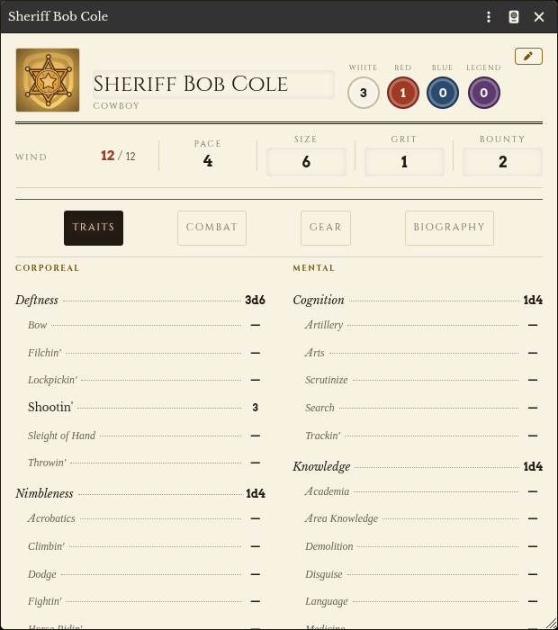
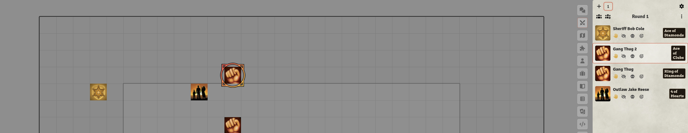
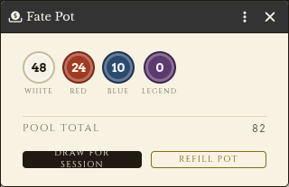
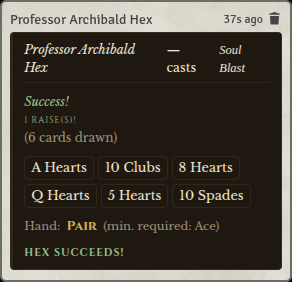

# Deadlands Classic — Community Edition

[](https://foundryvtt.com/)
[](https://opensource.org/licenses/MIT)
[](https://github.com/Chorss/deadlands-classic-fvtt/stargazers)
[](https://github.com/Chorss/deadlands-classic-fvtt/issues)

> *There's a reason they call it the Weird West, amigo. The Devil's been real busy
> since Gettysburg — and someone's gotta stop him.*
>
> — flavor text written for this project, not a quotation from any rulebook

A community-maintained Foundry VTT game system for **Deadlands Classic** (Weird West, 1876). Born from the ashes of two abandoned projects, this Community Edition rebuilds the full Classic experience on modern Foundry VTT V14+ APIs.

> **Scope note (v1):** This release targets **Deadlands Classic only**. *Hell on Earth Classic* and *Lost Colony Classic* are deferred to v2+ and will ship as companion modules rather than folded into core.

---

## Features

- **Exploding Dice (Aces)** — Roll maximum on any die? Pick it up and roll again, partner.
- **Dice Pools with Take-Highest** — Trait rolls keep the single best exploded die, not a sum.
- **Poker-Card Initiative** — Draw from a 54-card Action Deck (52 + 2 Jokers) for dramatic, unpredictable turn order. Suit tiebreakers, Red Joker bonus, Black Joker backlash.
- **Fate Chips (White / Red / Blue / Legend)** — Four-color chip economy drawn blind from a shared Fate Pot. Legend chips are the only way to reroll a Bust.
- **Location-Based Wounds** — 8 hit locations (Noggin, Upper/Lower Guts, Gizzards, both Arms, both Legs) rolled on 1d20 with 5 severity tiers (Light → Maimed).
- **Wind** — Secondary stamina pool driving fatigue, fear and non-lethal damage.
- **Arcane Backgrounds:**
  - **Huckster** — hexslingers drawing power from the Hunting Grounds via poker-hand resolution
  - **Shaman** — walking the spirit path, bargaining for favors with fetishes
  - **Blessed** — faith powers, Conviction-driven miracles
  - **Mad Scientist** — theory → blueprint → construction, with reliability checks on use
- **Harrowed Overlay** — Any PC can come back from the dead. Harrowed is an overlay applicable to *any* archetype, not a separate actor type.
- **Full Actor Support** — Cowboys, Hucksters, Shamans, Blessed, Mad Scientists, NPCs and Mooks.
- **Core Item Types** — Weapons, Armor, Gear, Edges, Hindrances, Ammo. (Archetype-specific items — Hexes, Miracles, Favors, Gizmos — registered by their archetype modules.)
- **Localization** — English and Polish supported from v0.1. Polish terminology follows the official MAG translation canon ("Wygrzebany", "Dominacja", "Kanciarz", etc.) — see [Terminology and rights](#terminology-and-rights).
- **Bundled Compendium** — an `action-deck` Cards pack (52 cards + 2 Jokers) for card initiative. Rulebook-derived content (Edges, Hindrances, Hexes, the hit-location table, example actors) ships separately — see [Content packs](#content-packs).

---

## Screenshots

Captured from a local V14 session (see `docs/testing-e2e.md`); source files live in
[`assets/screenshots/`](assets/screenshots/).

| | |
|---|---|
| <br>Archetype character sheet (traits, aptitudes, chips) | <br>Combat tracker with Action Card initiative |
| <br>Fate Chip widget and chip spend | <br>Hex casting with poker-hand evaluation |

---

## Installation

### Method 1: Foundry Package Browser (Recommended)

1. Open Foundry VTT and navigate to **Game Systems**.
2. Click **Install System**.
3. In the **Manifest URL** field, paste:
   ```
   https://github.com/Chorss/deadlands-classic-fvtt/releases/latest/download/system.json
   ```
4. Click **Install** and wait for completion.

### Method 2: Manual Installation

1. Download the latest release `.zip` from the [Releases page](https://github.com/Chorss/deadlands-classic-fvtt/releases).
2. Extract the archive into your Foundry VTT `Data/systems/` directory.
3. The folder must be named `deadlands-classic`.
4. Restart Foundry VTT.

### Content packs

The system ships the **engine** plus one compendium of plain playing cards. It
deliberately ships **no rulebook-derived content** — see
[Terminology and rights](#terminology-and-rights) for why.

Edges, Hindrances, Hexes, the hit-location RollTable and the example actors live in a
separate companion module, installed by manifest URL:

```
https://github.com/Chorss/deadlands-classic-fvtt/releases/latest/download/module.json
```

Install it under **Add-on Modules → Install Module**, then enable it in your world.
It is published from this repository's releases and is **not** listed in the Foundry
package registry. Source and details: [`content/`](content/README.md).

---

## Compatibility

| Foundry VTT Version | Status        |
|---------------------|---------------|
| V14                 | Supported     |
| V13                 | Not supported |
| V12 and below       | Not supported |

V14 requires **Node.js 24**. No backwards-compatibility shims are shipped for earlier versions — V13→V14 breaking changes (ApplicationV2, `documentTypes`, typed `ActiveEffect` fields) make a dual-target system impractical.

---

## Development Tooling

| Tool | Role |
|------|------|
| [PhpStorm](https://www.jetbrains.com/phpstorm/) | Primary IDE — JS/Handlebars support, integrated debugger |
| [Claude Code](https://claude.ai/code) (Anthropic) | AI engineering assistant — architecture review, code generation, localization parity, rule verification against PDF sources |
| [Biome](https://biomejs.dev/) | Formatter + linter (replaces ESLint + Prettier) |
| [node:test](https://nodejs.org/api/test.html) | Unit tests for pure core logic |

> AI tooling is used for **engineering acceleration**, not autonomous authorship.
> All architectural decisions, mechanic interpretations, and design choices are
> human-driven and verified against the official rulebook source.

---

## Acknowledgements

This project stands on the shoulders of giants. Deep gratitude to:

- **[Dulux-Oz](https://github.com/Dulux-Oz)** — Author of the original [DeadlandsClassic](https://github.com/Dulux-Oz/DeadlandsClassic) system. This project would not exist without their foundational work.
- **[RhombusWeasel](https://github.com/RhombusWeasel)** — Author of the alternative [Deadlands-Classic](https://github.com/RhombusWeasel/Deadlands-Classic) implementation and inspiration for several mechanics.
- All original contributors to both upstream projects.
- The Foundry VTT developer community for documentation and support.

---

## Contributing

We welcome contributions of all kinds — code, bug reports, documentation, translations, and playtesting feedback.

See [CONTRIBUTING.md](CONTRIBUTING.md) for full details on how to get involved.

For a full version history, see [CHANGELOG.md](CHANGELOG.md).

---

## License

This project's own code, templates and packaging are licensed under the **MIT License**.
See [LICENSE](LICENSE) for the full text.

### Trademark

Deadlands Classic, Hell on Earth Classic, and Lost Colony Classic are trademarks of
[Pinnacle Entertainment Group](https://peginc.com/). This is an unofficial, fan-made
project and is not affiliated with or endorsed by Pinnacle Entertainment Group. The same
notice is shown inside Foundry under **Settings → Deadlands Classic → Legal notice**.

### Terminology and rights

No rulebook text, tables or artwork are distributed with this system. Compendium entries
in the companion content module carry names and mechanical values with descriptions
written in our own words, cited to the page they came from; they are a mechanical index,
not a reproduction. You need the published rulebooks to play.

Polish terms follow the official **MAG** translation where one exists, and are used as
terminology only. Those translations remain the property of their publisher, who is a
separate rights holder from Pinnacle.

Every compendium icon is a core Foundry VTT asset; no artwork from any rulebook is
included.

### Bundled fonts

Four families are bundled so no stylesheet reaches a font CDN at runtime. All are used
under the **SIL Open Font License 1.1**; the full license and each family's copyright
notice travel with the files in [`fonts/OFL.txt`](fonts/OFL.txt).

| Family | Files | Upstream |
|---|---|---|
| Rye | `Rye-Regular` | [google/fonts · ofl/rye](https://github.com/google/fonts/tree/main/ofl/rye) |
| Libre Baskerville | `Regular`, `Bold`, `Italic` | [google/fonts · ofl/librebaskerville](https://github.com/google/fonts/tree/main/ofl/librebaskerville) |
| Arvo | `Regular`, `Bold`, `Italic` | [google/fonts · ofl/arvo](https://github.com/google/fonts/tree/main/ofl/arvo) |
| Cinzel | `Regular`, `Bold` | [google/fonts · ofl/cinzel](https://github.com/google/fonts/tree/main/ofl/cinzel) |
